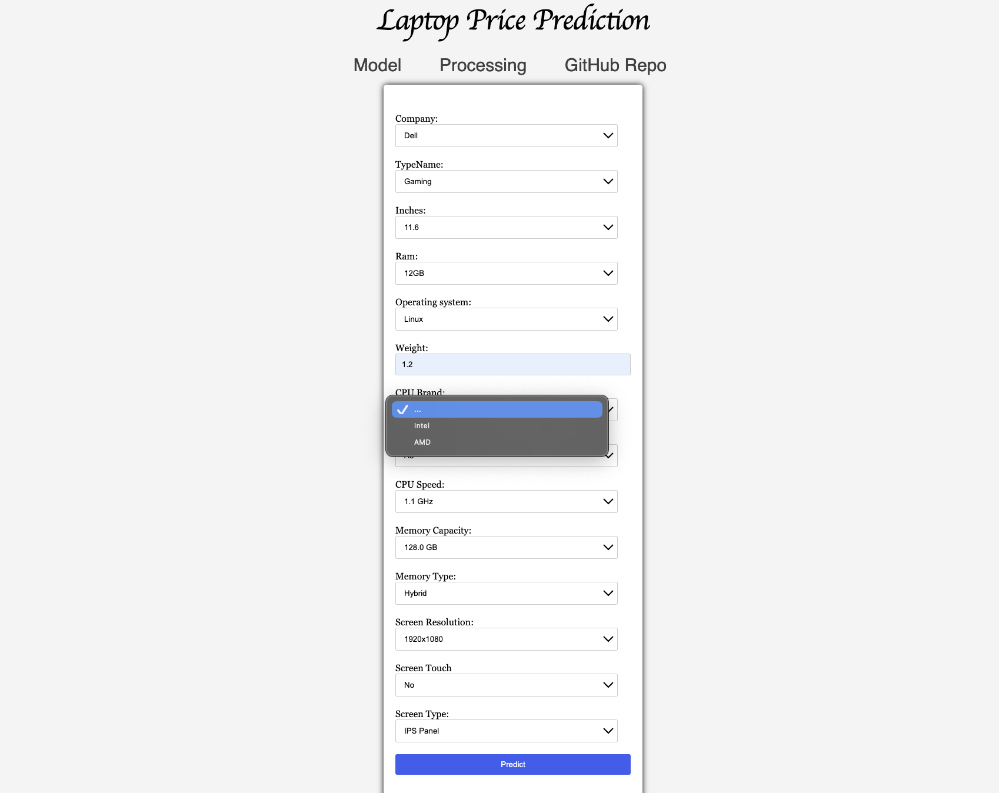

# Laptop Price Predictor

## A Machine Learning model deployed with a user interface to predict the price of laptops

### Introduction
A variety of laptop datasets that have eleven features; from company name to operating system. The aim is to predict the price in euro `target`.


### Repository Structure
* **README.md**: The top-level README for reviewers of this project
* **requirements.txt**: requirements file; including the needed tools
* **notebooks**: This folder has the jupyter notebooks process that helped me to address my work; `laptop_price.ipynb` is the first touch with the dataset, it showed me what are my next steps. `prepare_data.ipynb` is the process to clean and prepare my dataset to use it in deployment model. `data_analysis.ipynb` is a general look after data had cleaned. 
* **app**: 
    - **data folder**: has the dataset before and after cleaned.
    - **static folder**: has the images and css style used in model interface (html).
    - **templates folder**: This folder for html files.
    - **app.py**: Flask application.
    - **functions.py**: The static functions.
    - **model.py**: This python code used dataset cleaned to train the model.

### Libraries
* pandas
* NumPy
* scikit-learn
* xgboost
* flask


### Algorithm
XGBoost classifier provided the best results. 


## Getting the app running localy
1. Colone this repo
```
git clone https://github.com/khalidsbn/Laptop-Price-Predictor.git
```
2. Create and activate a virtual environment
```
python3 -m venv .venv
source .venv/bin/activate
```
3. Install the required dependencies (pandas, Numpy, etc)
```
pip install -r requirements.txt
```
4. Change into the `app` directory
```
cd app
```
5. Run app.py


Running the above command should result in you seeing the following:


This is the laptop price predictor; the app I'm making:

6. Try to enter the information about your laltopl and get the prediction.



7. You can also take a quick view of how the project was done in the `Processing` section, or go the the project's repo by clicking on `GitHub Repo`.


### Known issues
Still updating ...
